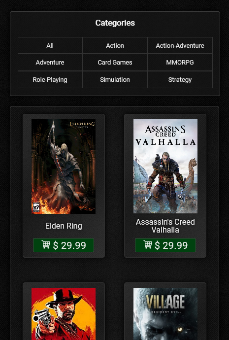

An e-commerce landing page, a challenge from the [Hiring Coders](https://www.hiringcoders.com.br) program.

Webpage: https://llfalcao.github.io/landing-page/

### Languages and Tools

<div style="display: inline_block">
    
    
    
    
    
</div>

### Screenshots

#### Desktop


#### Mobile

<p float="left" style="display: flex; justify-content:space-between">
  
  
</p>

### Running locally

Install [Yarn](https://yarnpkg.com/getting-started) and, at the root folder of the project, run:

```
yarn
yarn start
```
